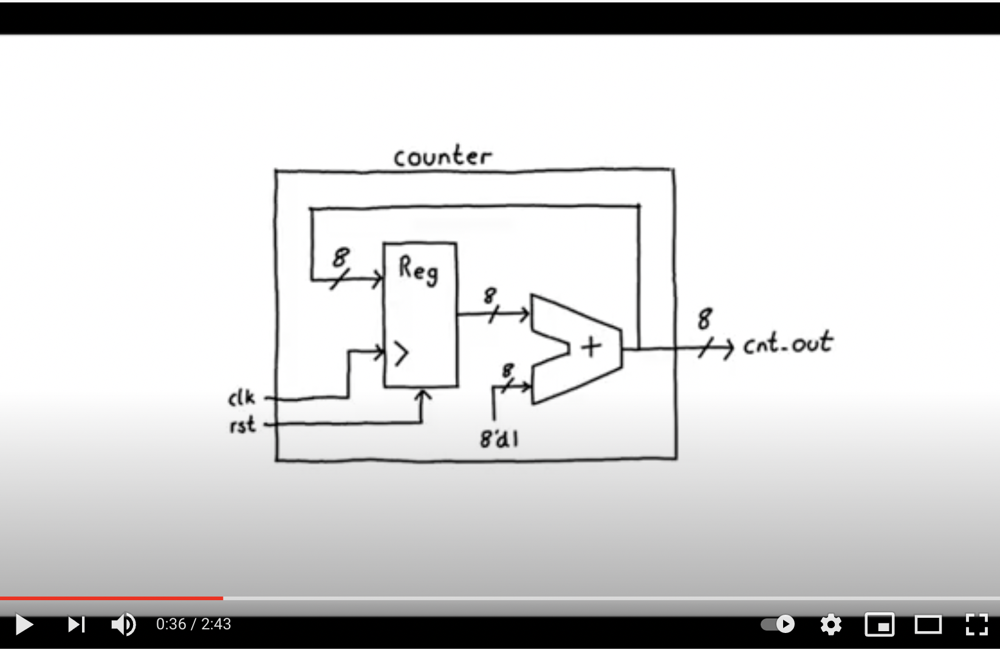

# EmSys: Synchronous Sequential Logic

In the previous lecture, we explored how to design logic circuits using the Verilog hardware description language. All the circuits we designed were combinatorial; these are circuits where the output depends solely on the current inputs. However, most circuits, such as CPUs, require the storage of state. Storing state means that the circuit depends on both the current inputs and the history of the device's execution.

Saving state introduces an extra layer of complexity when designing circuits, __synchronisation__. For combinatorial circuits, when the input changes, the effects are propagated through the circuit. However, these changes do not take place instantaneously but are subject to some delay. The time it takes the signal to propagate through gates and wires means that when the input changes it can take a time before the output changes.

To store state in the system, we essentially need to create a feedback loop in our circuit. Where data that is produced in previous iterations is taken from the output and sent back to the input. As the data is flowing back through the circuit, we have some memory of the output. 

<p align="center">
  
</p>

One way to save state is to feedback some of the output through a delayed line back to the input. However, this quickly becomes quite difficult to manage. Knowing the exact timings and precise the ordering of when signals arrive is challenging. These types of circuits are known as asynchronous sequential circuits and while they have a lot of benefits, for example, power efficiency or speed, they are generally too difficult to design for large circuits. 

For this reason, most digital circuits are synchronous sequential circuits. Where a synchronising signal, called a clock signal, is used to keep all parts of the circuit in tune with each other.

<p align="center">
  
</p>

The clock signal essentially rises and falls at a regular rate and is distributed to all parts of the circuit. Sequential elements of the circuit can change on the clock edge and use this to ensure that they all change at the same time, abstracting away a lot of the design complexity that occurs with asynchronous sequential circuits.

<p align="center">
  
</p>

In this lecture we will learn how to design such sequential circuits in Verilog. Generally, the form of these circuits will be: 
* A combinatorial portion where we assign some internal signals.
* A sequential storage element that stores some of the output of our combinatorial circuit and uses it to drive some of the inputs of our combinatorial logic.

__Like the previous Hardware Description Language repository the rest of this repository will consist of several short videos explaining some of the concepts that were covered in the lecture.__

## The DType FlipFlop
One of the most basic primitives of synchronous sequential logic is the DType FlipFlop. Please watch the following video to get an overview of the DType and how to describe it in Verilog. 

<p align="center">
        <a href="http://www.youtube.com/watch?feature=player_embedded&v=jlS4MDr58C8
        " target="_blank"></a>
</p>

To run the example in this repository _on the lab machines_ please use the following:

```
	cd DType/
	make
```

Once the simulation completes you can then open ``gtkwave`` to look at the waveform.

```
        gtkwave wavedump.vcd
```

## A counter circuit 
We can chain multiple DType FlipFlops together to make a register that can store a multibit number. These registers can then be used to store data or interate over data, such as a counter. Please watch the following video on how to make a counter circuit with Verilog:

<p align="center">
        <a href="http://www.youtube.com/watch?feature=player_embedded&v=U3K91t8aIXA
        " target="_blank"></a>
</p>

To run the example in this repository _on the lab machines_ please use the following:

```
	cd counter/
	make
```

Once the simulation completes you can then open ``gtkwave`` to look at the waveform.

```
        gtkwave wavedump.vcd
```

## Conditionally updating a register 
Often we don't want a register value to be updated every clock cycle, we want to add a condition on when it can update. This is often referred to as a write enable signal. Please watch the following video that demonstrates this:

<p align="center">
        <a href="http://www.youtube.com/watch?feature=player_embedded&v=rLxE8sf2zPM
        " target="_blank"></a>
</p>

To run the example in this repository _on the lab machines_ please use the following:

```
	cd write_enable/
	make
```

Once the simulation completes you can then open ``gtkwave`` to look at the waveform.

```
        gtkwave wavedump.vcd
```

## Memory-mapped interface 
On our TinyPicos we interact with hardware through pointers to memory mapped hardware locations. However, what does this look like from a hardware perspective? Please watch the following video that will introduce a Lite memory mapped hardware interface (similar to the AXI Lite interface used in ARM processors). 

<p align="center">
        <a href="http://www.youtube.com/watch?feature=player_embedded&v=gax3yg27doc
        " target="_blank"></a>
</p>

To run the example in this repository _on the lab machines_ please use the following:

```
	cd write_enable/
	make
```

Once the simulation completes you can then open ``gtkwave`` to look at the waveform.

```
        gtkwave wavedump.vcd
```


